# ☁️ CloudBase 轻量应用服务器 · 前后端完整部署指南

> **面向人群**：没有 Docker 经验、没有云服务器运维经验的开发者。  
> **预计耗时**：首次约 45 分钟。  
> **适用项目**：contract-analyzer（Next.js 15 前端 + FastAPI 后端 + CloudBase PostgreSQL）

---

## 🏗️ 项目架构速览

```
用户浏览器
    │
    ▼
┌──────────────────────────────┐
│  轻量应用服务器 (2核4GB+)     │
│                              │
│  ┌────────────────────────┐  │
│  │ frontend (port 3000)    │  │
│  │ Next.js 15 standalone   │──┼──── HTTP ────┐
│  └────────┬───────────────┘  │              │
│           │ /api/backend-proxy│              ▼
│           ▼                  │  ┌──────────────────┐
│  ┌────────────────────────┐  │  │ CloudBase         │
│  │ backend  (port 8000)    │  │  │ PostgreSQL        │
│  │ FastAPI + LibreOffice   │  │  └──────────────────┘
│  └────────────────────────┘  │
└──────────────────────────────┘
```

- **frontend**（端口 3000）：用户界面 + API 路由，通过 `BACKEND_API_BASE_URL` 环境变量把合同解析请求转发给后端。
- **backend**（端口 8000）：合同文件解析（DOCX/DOC/PDF）+ LLM 分析，包含 LibreOffice 用于 DOC 转 DOCX。
- **数据库**：CloudBase PostgreSQL，独立于服务器，通过外网连接。

---

## 📌 前置准备（一次性）

| 序号 | 检查项 | 如何确认 |
|------|--------|----------|
| 1 | CloudBase 环境已开通 | [CloudBase 控制台](https://console.cloud.tencent.com/tcb) 能看到环境列表 |
| 2 | 轻量应用服务器入口可用 | 左侧菜单 `云函数/托管/主机` → `云服务器` 可正常进入 |
| 3 | PostgreSQL 数据库已创建 | 控制台 → `SQL 型数据库` → 有实例，记录 **外网地址和端口** |
| 4 | Docker Desktop 已安装 | 终端执行 `docker --version` 输出版本号 |
| 5 | Docker Hub 账号（免费） | [hub.docker.com](https://hub.docker.com) 注册，记录 **用户名和密码** |
| 6 | 项目代码在本地 | `E:\Feidu\Task\contract-analyzer\` 目录存在 |

---

## 🗺️ 总体流程

```
① Docker Hub 创建仓库 → ② 本地构建前端镜像+后端镜像 → ③ 推送到 Docker Hub
                                                                    │
            ┌───────────────────────────────────────────────────────┘
            ▼
④ CloudBase 创建 Docker CE 服务器 → ⑤ SSH 登录 → ⑥ 上传 docker-compose.yml
            │
            ▼
⑦ 放通服务器防火墙端口（3000/8000） → ⑧ 放通 Neon 数据库白名单
            │
            ▼
⑨ docker compose up -d → ⑩ 验证访问
```

---

## 第一步：Docker Hub 准备（5 分钟，一次性）

> 💡 不用腾讯云 TCR（企业版有门槛），用 Docker Hub 免费版即可。

### 1.1 注册 / 登录

打开 [https://hub.docker.com](https://hub.docker.com)，注册一个免费账号。记住你的用户名，后续用来拼镜像地址。

### 1.2 本地登录 Docker Hub

```bash
docker login -u <你的DockerHub用户名>
# 输入密码（输的时候不显示字符，正常，输完回车）
```

出现 `Login Succeeded` 即为成功。

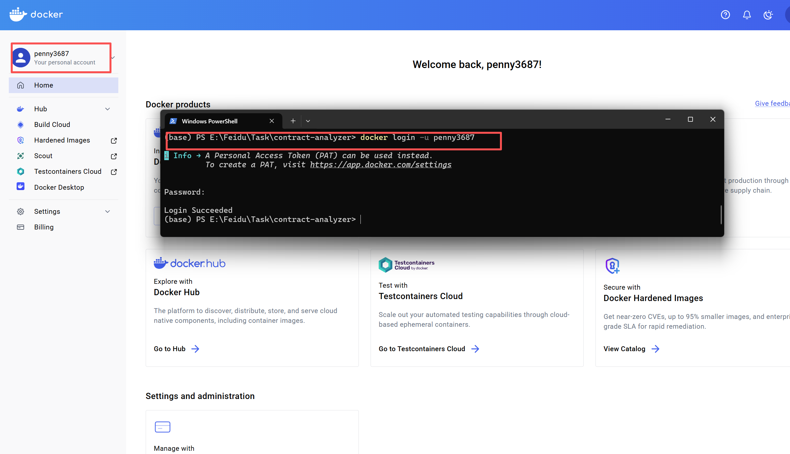

---

## 第二步：本地构建并推送镜像（10-15 分钟）

> ⚠️ 以下全部在你的电脑终端（PowerShell 或 Git Bash）中执行。需要构建 **两个** 镜像：前端 + 后端。

### 2.1 构建后端镜像

```bash
cd E:\Feidu\Task\contract-analyzer\backend

docker pull docker.m.daocloud.io/library/python:3.11-slim
docker tag docker.m.daocloud.io/library/python:3.11-slim python:3.11-slim
docker build -t <你的用户名>/contract-analyzer-backend:latest .
```

- 基于 `python:3.11-slim`，安装 LibreOffice + pip 依赖。
- **首次构建约 5-10 分钟**（LibreOffice 比较大，约 300MB）。
- 看到 `Successfully tagged` 说明构建成功。

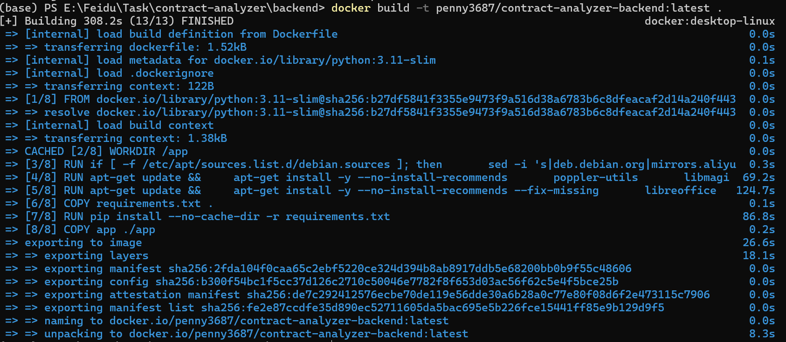

### 2.2 推送后端镜像

```bash
docker login
docker push <你的用户名>/contract-analyzer-backend:latest
```

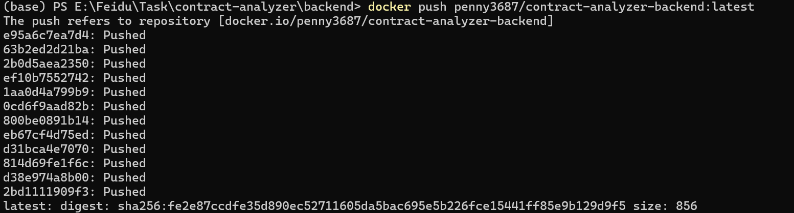

### 2.3 构建前端镜像

```bash
cd E:\Feidu\Task\contract-analyzer\frontend
docker pull docker.m.daocloud.io/library/node:20-alpine
docker tag docker.m.daocloud.io/library/node:20-alpine node:20-alpine
docker build -t <你的用户名>/contract-analyzer-frontend:latest .
```

- 基于 `node:20-alpine`，`npm ci` → `next build` → standalone 输出。
- **首次构建约 3-8 分钟**。

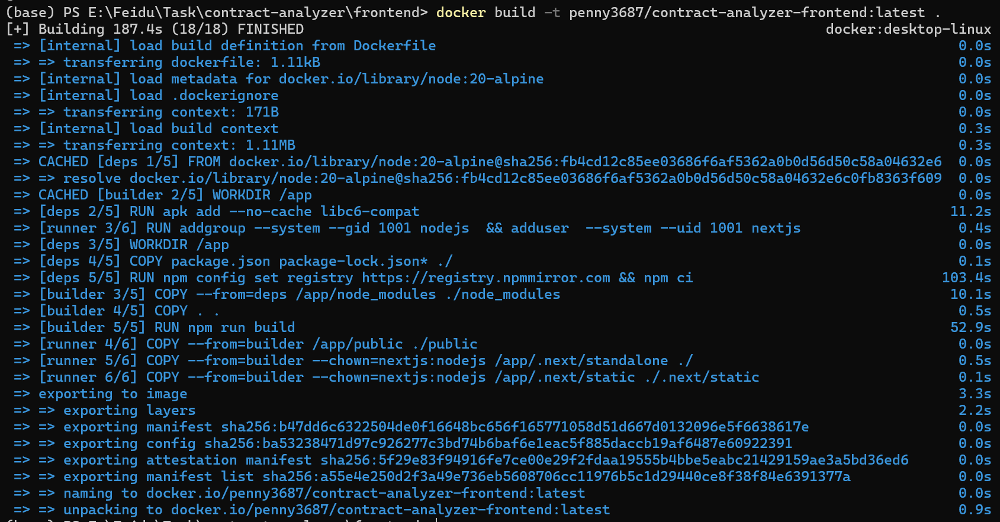

### 2.4 推送前端镜像

```bash
docker push <你的用户名>/contract-analyzer-frontend:latest
```

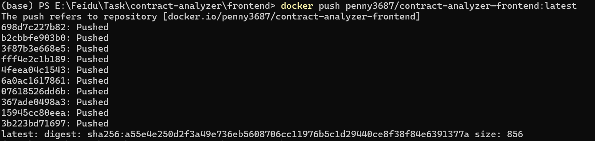

### ✅ 验证

打开 [https://hub.docker.com/repositories](https://hub.docker.com/repositories)，应该能看到两个仓库：

| 仓库名 | 标签 |
|--------|------|
| `contract-analyzer-backend` | `latest` |
| `contract-analyzer-frontend` | `latest` |

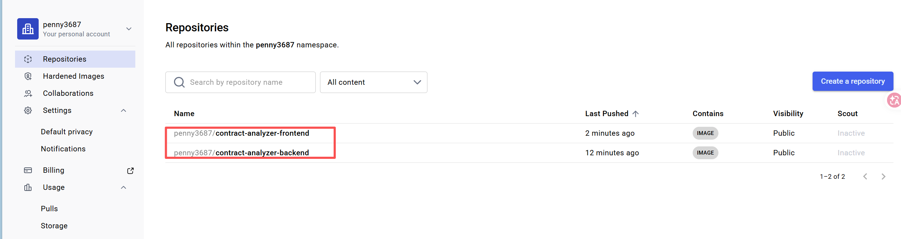

---

## 第三步：CloudBase 创建服务器（3 分钟）

> ⚠️ 不能用「使用容器镜像」模式（它只能跑**一个**容器，没法编排前后端两个）。
> 要改用 **Docker CE 应用模板**，这是一台自带 Docker 的 Linux，支持 `docker compose`。

### 3.1 进入创建页

CloudBase 控制台 → 左侧 `云函数/托管/主机` → `云服务器` → `轻量应用服务器` → 点击 `创建实例`

### 3.2 选择创建方式

页面顶部三种创建方式，这次选 **「使用应用模板」**，然后在模板列表里找到 **「Docker CE」** 并选中。

> Docker CE 模板 = 一台安装了 Docker Engine 的 Linux 服务器，你可以通过 SSH 上去执行任何 docker 命令。

### 3.3 填写配置

| 配置项 | 选择 | 说明 |
|--------|------|------|
| **地域** | 上海 | 当前仅支持上海 |
| **可用区** | 随机分配 | 不选也可以 |
| **套餐类型** | 入门型 | |
| **套餐规格** | **3144 点/天（2核8GB）** | 前后端 + LibreOffice，4GB 偏紧张，推荐 8GB |
| **登录方式** | 先选 **密码登录** 或跳过 | 创建成功后再绑定密钥（见 3.5） |
| **实例名称** | `contract-analyzer-prod` | 随意 |

> ⚠️ **为什么推荐 2核8GB**：后端 LibreOffice 在转换 DOC 文件时瞬时内存可达 1-2GB，加上 Node.js 前端常驻内存约 500MB-1GB，Python FastAPI 约 300MB，4GB 可能在峰值时 OOM。如果你的合同文件普遍较小（<5MB），可以先试 2核4GB。

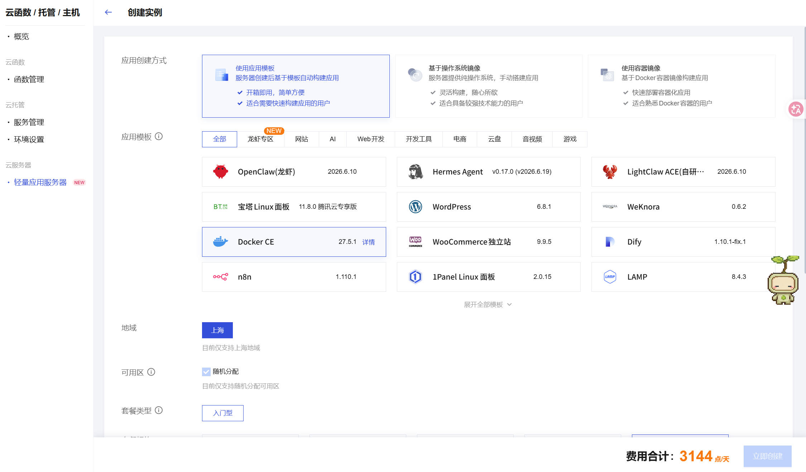

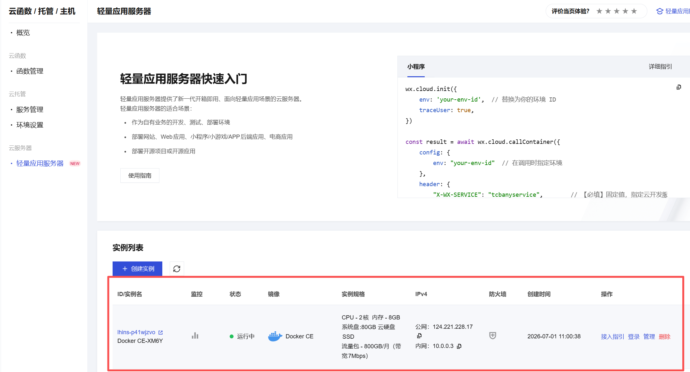

> 💡 提示：你电脑上如果已经有 SSH 密钥（如 `id_ed25519_github`），可以直接用它的公钥，不需要再生成。下面的命令用于创建一把新的专用密钥。

### 3.4 生成 SSH 密钥（Windows）

Windows 命令提示符不支持 `~` 简写，要写成完整路径：

```bash
ssh-keygen -t ed25519 -C "cloudbase-deploy" -f ~\.ssh\cloudbase_key
```

- `~\.ssh\cloudbase_key` → **私钥**，留在你电脑上，不要发给任何人
- `~\.ssh\cloudbase_key.pub` → **公钥**，复制内容粘贴到 CloudBase

打开公钥文件复制内容：

```bash
notepad ~\.ssh\cloudbase_key.pub
```

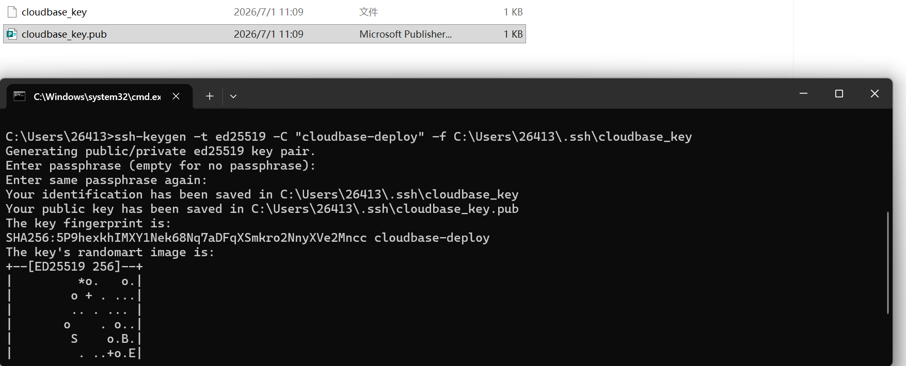

### 3.5 创建后绑定密钥

1. 点击「立即创建」，等待 **2-5 分钟**，状态变为 `运行中`。
2. 在实例详情页找到 **「密钥」** 一行，点击 **「前往绑定」** 或 **「绑定密钥」**。
3. 选择「绑定已有密钥」或「使用公钥内容」，把 3.4 复制的公钥字符串粘贴进去，确认绑定。
4. 绑定成功后，该密钥对应的私钥即可用来 SSH 登录服务器。

### 3.6 记录关键信息

| 信息 | 用途 |
|------|------|
| **公网 IP**（如 `123.xxx.xxx.xxx`） | 浏览器访问 + 数据库白名单 |
| **内网 IP**（如 `10.xxx.xxx.xxx`） | 可选，同地域走内网更快 |

---

## 第四步：SSH 登录并部署（10 分钟）

### 4.1 登录服务器

```bash
ssh -i ~\.ssh\cloudbase_key ubuntu@<服务器公网IP>
```

> 注意：要用**公网 IP**（如 `124.0.0.x`），不是内网 IP（如 `10.0.0.x`）。

第一次会问 `Are you sure you want to continue connecting?`，输入 `yes` 回车。

> 如果提示 `Permission denied`，可能是用户名不是 `ubuntu`，可以尝试 `root`：
> ```bash
> ssh -i ~\.ssh\cloudbase_key ubuntu@<服务器公网IP>
> ```

登录成功后终端提示符变成 `ubuntu@xxx:~$`。 

### 4.2 验证 Docker 可用

```bash
docker --version
docker compose version
```

都应该输出版本号。如果提示 `docker: command not found`，等 1 分钟再试（Docker CE 模板可能在后台安装中）。

### 4.3 登录 Docker Hub（在服务器上）

```bash
docker login -u <你的DockerHub用户名>
# 输入密码
```

> 如果出现网络问题改用下面指令

本地 Windows：
```bash
docker save penny3687/contract-analyzer-backend:latest -o backend.tar
docker save penny3687/contract-analyzer-frontend:latest -o frontend.tar
scp -i ~\.ssh\cloudbase_key backend.tar frontend.tar ubuntu@你的服务器IP:/home/ubuntu/
```

服务器：
```bash
sudo docker load -i backend.tar
sudo docker load -i frontend.tar
sudo docker images
```
这样不需要 docker login / docker pull。

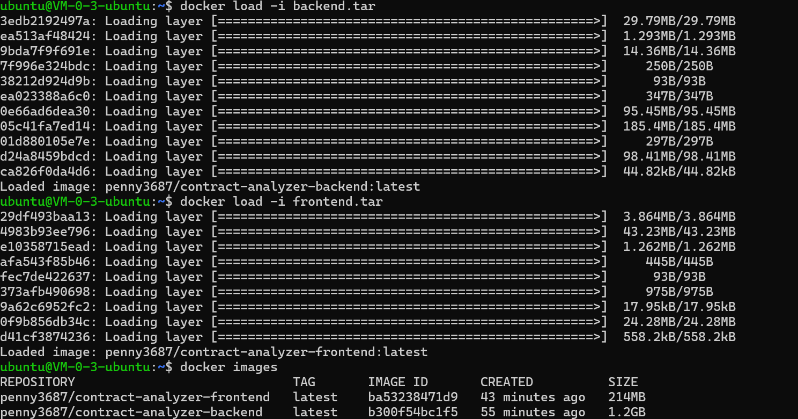

### 4.4 创建部署目录并上传 docker-compose.yml

在服务器上：

```bash
sudo mkdir -p /opt/contract-analyzer
cd /opt/contract-analyzer
sudo chown -R ubuntu:ubuntu /opt/contract-analyzer
```

在你的 **本地电脑** 上，找到项目根目录的 `docker-compose.yml`：

```
E:\Feidu\Task\contract-analyzer\docker-compose.yml
```

用你熟悉的工具上传到服务器的 `/opt/contract-analyzer/` 目录。最简单的方式：

**方式 A：在服务器上直接创建文件**

```bash
# 在服务器终端中执行
cat > /opt/contract-analyzer/docker-compose.yml << 'DOCKEREOF'
version: "3.8"

services:
  backend:
    image: <你的用户名>/contract-analyzer-backend:latest
    container_name: contract-backend
    ports:
      - "8000:8000"
    environment:
      - APP_VERSION=v6.0.0
      - OPENAI_API_KEY=<你的API Key>
      - OPENAI_BASE_URL=https://api.openai.com/v1
      - OPENAI_MODEL=gpt-4.1-mini
      - MAX_UPLOAD_MB=20
      - MAX_BATCH_FILES=20
      - ENABLE_OCR=false
      - ENABLE_DOC_CONVERT=true
    restart: unless-stopped

  frontend:
    image: <你的用户名>/contract-analyzer-frontend:latest
    container_name: contract-frontend
    ports:
      - "3000:3000"
    environment:
      - NODE_ENV=production
      - DATABASE_URL=postgresql://<PG用户名>:<PG密码>@<PG外网地址>:<PG端口>/postgres
      - PG_SSL=true
      - PG_SSL_REJECT_UNAUTHORIZED=false
      - NEXT_PUBLIC_BACKEND_API_BASE_URL=http://backend:8000
      - BACKEND_API_BASE_URL=http://backend:8000
    depends_on:
      - backend
    restart: unless-stopped
DOCKEREOF
```

> ⚠️ 把上面内容中所有 `<...>` 占位符替换为你的真实值：
> - `<你的用户名>`：Docker Hub 用户名
> - `<PG用户名>/<PG密码>/<PG外网地址>/<PG端口>`：CloudBase PostgreSQL 连接信息
> - `<你的API Key>`：OpenAI 兼容 API Key

**方式 B：用 SCP 上传**（如果你安装了 Git Bash）

```bash
# 在本地终端执行（Git Bash / PowerShell 都可用）
scp -i ~\.ssh\cloudbase_key E:\Feidu\Task\contract-analyzer\docker-compose.yml ubuntu@<服务器公网IP>:/opt/contract-analyzer/
```

### 4.5 拉取镜像并启动

```bash
cd /opt/contract-analyzer

# 拉取最新镜像
docker compose pull

# 启动
docker compose up -d
```

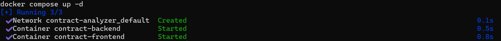

等待 1-2 分钟，执行以下命令确认两个容器都在运行：

```bash
docker compose ps
```

应该看到两行，Status 都是 `Up`：

```
NAME                STATUS
contract-backend    Up 2 minutes
contract-frontend   Up 1 minute
```

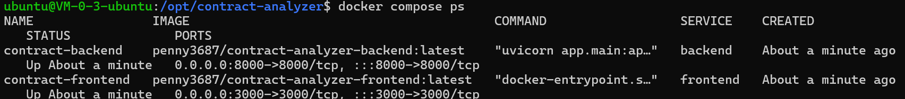

### 4.6 查看日志（如有问题）

```bash
# 看所有容器日志
docker compose logs

# 只看某个容器
docker compose logs backend
docker compose logs frontend

# 实时跟踪
docker compose logs -f
```

---

## 第五步：放通服务器防火墙端口

> 容器已在服务器上运行，但 CloudBase 默认防火墙会屏蔽非标准端口（如 3000、8000），需要手动放通后才能从外网访问。

### 5.1 CloudBase 控制台放通端口

1. 打开 CloudBase 轻量应用服务器控制台
2. 点击实例
3. 左侧菜单找到 **「防火墙」**
4. 点击 **「添加规则」**
5. 逐条添加以下规则：

| 协议 | 端口 | 来源 | 备注 |
|------|------|------|------|
| TCP  | `3000`  | `0.0.0.0/0` | Next.js 前端（必开） |
| TCP  | `8000`  | `0.0.0.0/0` | FastAPI 后端（可选） |

> 添加完后规则列表应显示两条，状态为「允许」。

### 5.2 服务器本地防火墙（如需要）

如果 CloudBase 防火墙已放通但外网仍不通，可能是服务器本地防火墙（ufw）拦截了：

```bash
# 查看防火墙状态
sudo ufw status

# 如果显示 Status: active，开放端口
sudo ufw allow 3000/tcp
sudo ufw allow 8000/tcp
sudo ufw reload
```

### 5.3 验证端口是否放通

在服务器上：

```bash
# 确认容器端口在监听
ss -tlnp | grep 3000
```

应该看到 `LISTEN 0  128  0.0.0.0:3000`。

在本地浏览器访问 `http://公网IP:3000`，能加载页面即为成功。

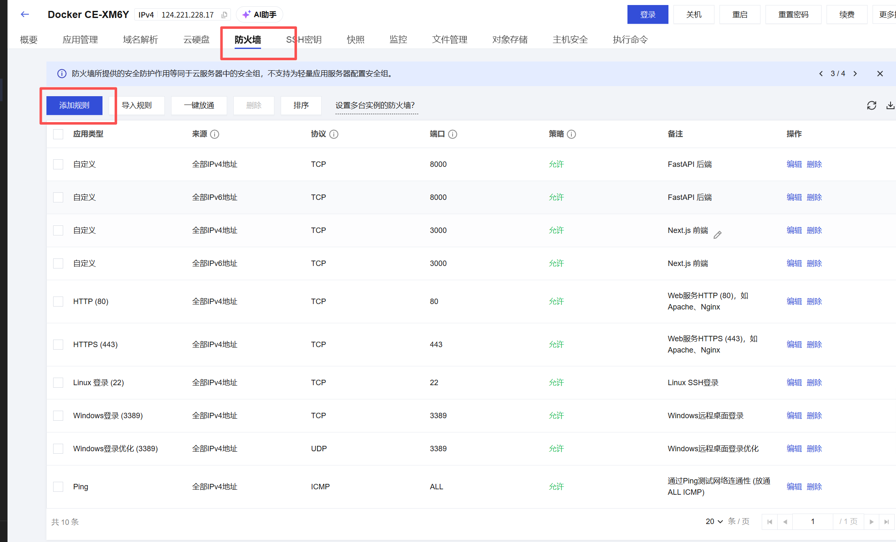

---

## 第六步：放通 Neon 数据库白名单

> 其非必须

### 6.1 进入 Neon 控制台

[Neon Console](https://console.neon.tech) → 选择你的项目 → 左侧 `Settings` → `IP Allow`

### 6.2 添加服务器公网 IP

| 操作 | 说明 |
|------|------|
| 点击 `Add IP` | |
| **IP 地址** | 服务器的 **公网 IP**（`公网IP`） |
| **备注** | contract-analyzer |

> 如果 Neon 支持 CIDR 格式，也可以填 `公网IP/32`。

### 6.3 验证连接

在服务器上：

```bash
docker compose exec frontend node -e "
const { Pool } = require('pg');
const pool = new Pool({ connectionString: process.env.DATABASE_URL });
pool.query('SELECT 1').then(r => { console.log('OK:', r.rows[0]); pool.end(); }).catch(e => { console.error('FAIL:', e.message); pool.end(); });
"
```

输出 `OK: { '?column?': 1 }` 即连接成功。

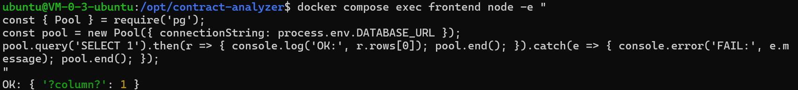
---

## 第七步：验证部署 🎉

### 7.1 浏览器访问前端

```
http://<服务器公网IP>:3000
```

页面正常加载即为成功。

### 7.2 验证后端健康

```
http://<服务器公网IP>:8000/api/health
```

返回：

```json
{"ok": true, "service": "contract-analyzer-backend", "version": "v6.0.0"}
```

### 7.3 验证前后端联通

在浏览器打开前端页面，上传一个 DOCX 合同文件，能正常解析出内容即说明前后端通路正常。

### 7.4 验证数据库

```
http://<服务器公网IP>:3000/api/feedback?page=1&pageSize=5
```

返回 `{"data":[],"total":0,...}`（空列表也是正常的）表示数据库连接成功。

---

## 第八步（可选）：绑定域名 + HTTPS

### 8.1 用 Caddy 反向代理（最简单）

SSH 登录服务器后：

```bash
# 安装 Caddy
apt update && apt install -y debian-keyring debian-archive-keyring apt-transport-https
curl -1sLf 'https://dl.cloudsmith.io/public/caddy/stable/gpg.key' | gpg --dearmor -o /usr/share/keyrings/caddy-stable-archive-keyring.gpg
curl -1sLf 'https://dl.cloudsmith.io/public/caddy/stable/debian.deb.txt' | tee /etc/apt/sources.list.d/caddy-stable.list
apt update && apt install -y caddy

# 编辑配置
cat > /etc/caddy/Caddyfile << 'EOF'
你的域名 {
    reverse_proxy localhost:3000
}
EOF

# 启动
systemctl restart caddy
```

### 8.2 配置 DNS

去域名服务商添加 A 记录：

| 记录类型 | 主机记录 | 记录值 |
|----------|---------|--------|
| A | `@` 或子域名 `app` | 服务器公网 IP |

生效后用 `https://你的域名` 即可访问。

---

## 🔄 日常更新流程

每次代码改动后：

```bash
# ===== 本地 =====

# 1. 重新构建并推送后端（如果有改动）
cd E:\Feidu\Task\contract-analyzer\backend
docker build -t <你的用户名>/contract-analyzer-backend:latest .
docker push <你的用户名>/contract-analyzer-backend:latest

# 2. 重新构建并推送前端
cd E:\Feidu\Task\contract-analyzer\frontend
docker build -t <你的用户名>/contract-analyzer-frontend:latest .
docker push <你的用户名>/contract-analyzer-frontend:latest

# ===== 服务器 =====
ssh -i ~\.ssh\cloudbase_key ubuntu@<服务器IP>

cd /opt/contract-analyzer
docker compose pull          # 拉最新镜像
docker compose up -d          # 重建容器
docker compose logs -f --tail=50  # 看日志确认启动正常
```

---

## 📋 环境变量完整速查表

### 前端容器 (`contract-frontend`)

| 变量名 | 必填 | 默认值 | 说明 |
|--------|------|--------|------|
| `NODE_ENV` | ✅ | - | 固定 `production` |
| `DATABASE_URL` | ✅ | - | PostgreSQL 连接串 |
| `PG_SSL` | 否 | `true` | 是否启用 SSL |
| `PG_SSL_REJECT_UNAUTHORIZED` | 否 | `false` | 自签证书建议 false |
| `NEXT_PUBLIC_BACKEND_API_BASE_URL` | ✅ | - | **容器间用** `http://backend:8000` |
| `BACKEND_API_BASE_URL` | ✅ | - | 同上 |
| `OPENAI_API_KEY` | 否 | - | 前端直接调 AI 时使用 |

### 后端容器 (`contract-backend`)

| 变量名 | 必填 | 默认值 | 说明 |
|--------|------|--------|------|
| `APP_VERSION` | 否 | `v6.0.0` | 版本号 |
| `OPENAI_API_KEY` | ✅ | - | LLM 分析用 API Key |
| `OPENAI_BASE_URL` | 否 | `https://api.openai.com/v1` | API 地址 |
| `OPENAI_MODEL` | 否 | `gpt-4.1-mini` | 模型名 |
| `BACKEND_ADMIN_TOKEN` | 否 | - | 管理员口令，不设则无认证 |
| `MAX_UPLOAD_MB` | 否 | `20` | 单文件最大上传（MB） |
| `MAX_BATCH_FILES` | 否 | `20` | 每批最多合同数 |
| `ENABLE_OCR` | 否 | `true` | 是否开启扫描件 OCR |
| `ENABLE_DOC_CONVERT` | 否 | `true` | 是否开启 DOC→DOCX 转换 |
| `LIBREOFFICE_PATH` | 否 | 自动检测 | LibreOffice 可执行文件路径 |
| `TENCENTCLOUD_SECRET_ID` | 否 | - | OCR 需要腾讯云密钥 |
| `TENCENTCLOUD_SECRET_KEY` | 否 | - | OCR 需要腾讯云密钥 |

---

## ❓ 常见问题

### Q1：docker compose up 后容器反复重启

```bash
docker compose logs --tail=50
```

看最后几行日志，通常是环境变量配错了。

### Q2：后端容器报 LibreOffice 找不到

Dockerfile 里已经安装了 LibreOffice，正常情况下路径是 `/usr/lib/libreoffice/program/soffice`。如果找不到，在 docker-compose.yml 里显式设置：

```yaml
environment:
  - LIBREOFFICE_PATH=/usr/lib/libreoffice/program/soffice
```

### Q3：上传合同文件后解析失败 / 超时

1. 确认后端容器正在运行：`docker compose ps`
2. 确认前端 `BACKEND_API_BASE_URL` 配的是 `http://backend:8000`（不是 `localhost`）
3. docker-compose 中两个服务在同一个 Docker 网络内，通过 service name（`backend`）互访

### Q4：服务器内存不够 / 容器被 OOM Kill

```bash
# 查看容器资源占用
docker stats --no-stream
```

如果 `contract-backend` 内存超过 1.5GB，考虑：
1. 设置 `ENABLE_OCR=false` 关闭 OCR（省 500MB+）
2. 升级服务器套餐到 2核8GB

### Q5：如何查看 Docker Hub 上的镜像？

浏览器打开 `https://hub.docker.com/r/<你的用户名>/contract-analyzer-frontend`

### Q6：忘记 Docker Hub 密码

[https://hub.docker.com/reset-password/](https://hub.docker.com/reset-password/) 重置。

---

## 🧰 附录：本地完整测试

如果你想先在本地验证前后端联调是否正常：

```bash
cd E:\Feidu\Task\contract-analyzer

# 创建 .env 文件（把 .env.example 或 .env.local 的值填上）
cp frontend/.env.local .env   # 或手动创建

# 一键启动
docker compose up -d

# 浏览器访问
# 前端：http://localhost:3000
# 后端：http://localhost:8000/api/health

# 停止
docker compose down
```

---

> 📝 **文档版本**：v2.0 | **最后更新**：2026-07-01  
> 🔗 **项目根目录**：`E:\Feidu\Task\contract-analyzer\`
